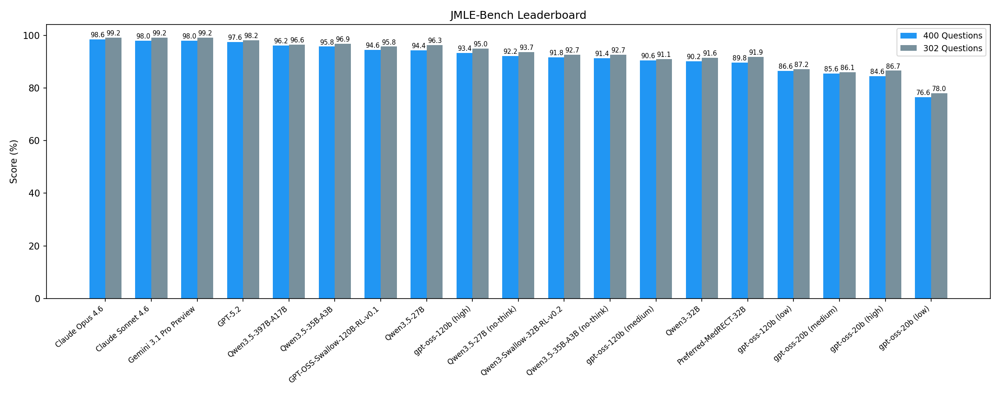

# JMLE2026-Bench (IgakuQA120)

LLM benchmark on the 120th Japanese Medical Licensing Examination (Feb 7-8, 2026).

400 questions (302 text-only + 98 with clinical images) structured as JSON with ground-truth answers.

Previous year (119th): [IgakuQA119](https://github.com/naoto-iwase/IgakuQA119) (Feb 8-9, 2025)

## Leaderboard



### All (400 Questions)

<!-- leaderboard-all-start -->
| Model | Vision | Score | Accuracy |
|-----|------|-----|--------|
| **Claude Opus 4.6** | ✓ | 493/500 (98.6%) | 393/400 (98.2%) |
| **Claude Sonnet 4.6** | ✓ | 490/500 (98.0%) | 392/400 (98.0%) |
| **Gemini 3.1 Pro Preview** | ✓ | 490/500 (98.0%) | 390/400 (97.5%) |
| **GPT-5.2** | ✓ | 488/500 (97.6%) | 388/400 (97.0%) |
| **Qwen3.5-397B-A17B** | ✓ | 481/500 (96.2%) | 383/400 (95.8%) |
| **Qwen3.5-35B-A3B** | ✓ | 479/500 (95.8%) | 379/400 (94.8%) |
| **GPT-OSS-Swallow-120B-RL-v0.1** | - | 473/500 (94.6%) | 379/400 (94.8%) |
| **Qwen3.5-27B** | - | 472/500 (94.4%) | 378/400 (94.5%) |
| **gpt-oss-120b (high)** | - | 467/500 (93.4%) | 373/400 (93.2%) |
| **Qwen3.5-27B (no-think)** | - | 461/500 (92.2%) | 365/400 (91.2%) |
| **Qwen3-Swallow-32B-RL-v0.2** | - | 459/500 (91.8%) | 365/400 (91.2%) |
| **Qwen3.5-35B-A3B (no-think)** | ✓ | 457/500 (91.4%) | 367/400 (91.8%) |
| **gpt-oss-120b (medium)** | - | 453/500 (90.6%) | 363/400 (90.8%) |
| **Qwen3-32B** | - | 451/500 (90.2%) | 355/400 (88.8%) |
| **Preferred-MedRECT-32B** | - | 449/500 (89.8%) | 357/400 (89.2%) |
| **gpt-oss-120b (low)** | - | 433/500 (86.6%) | 343/400 (85.8%) |
| **gpt-oss-20b (medium)** | - | 428/500 (85.6%) | 342/400 (85.5%) |
| **gpt-oss-20b (high)** | - | 423/500 (84.6%) | 335/400 (83.8%) |
| gpt-oss-20b (low) | - | 383/500 (76.6%) | 303/400 (75.8%) |
<!-- leaderboard-all-end -->

*Bold = passes both required (160/200) and general (221/300) thresholds based on [previous year's criteria](#scoring).*

### Text-only (302 Questions)

<!-- leaderboard-text-start -->
| Model | Score | Accuracy |
|-----|-----|--------|
| Claude Opus 4.6 | 379/382 (99.2%) | 299/302 (99.0%) |
| Claude Sonnet 4.6 | 379/382 (99.2%) | 299/302 (99.0%) |
| Gemini 3.1 Pro Preview | 379/382 (99.2%) | 299/302 (99.0%) |
| GPT-5.2 | 375/382 (98.2%) | 295/302 (97.7%) |
| Qwen3.5-35B-A3B | 370/382 (96.9%) | 290/302 (96.0%) |
| Qwen3.5-397B-A17B | 369/382 (96.6%) | 291/302 (96.4%) |
| Qwen3.5-27B | 368/382 (96.3%) | 290/302 (96.0%) |
| GPT-OSS-Swallow-120B-RL-v0.1 | 366/382 (95.8%) | 290/302 (96.0%) |
| gpt-oss-120b (high) | 363/382 (95.0%) | 287/302 (95.0%) |
| Qwen3.5-27B (no-think) | 358/382 (93.7%) | 280/302 (92.7%) |
| Qwen3.5-35B-A3B (no-think) | 354/382 (92.7%) | 280/302 (92.7%) |
| Qwen3-Swallow-32B-RL-v0.2 | 354/382 (92.7%) | 280/302 (92.7%) |
| Preferred-MedRECT-32B | 351/382 (91.9%) | 277/302 (91.7%) |
| Qwen3-32B | 350/382 (91.6%) | 274/302 (90.7%) |
| gpt-oss-120b (medium) | 348/382 (91.1%) | 276/302 (91.4%) |
| gpt-oss-120b (low) | 333/382 (87.2%) | 263/302 (87.1%) |
| gpt-oss-20b (high) | 331/382 (86.7%) | 257/302 (85.1%) |
| gpt-oss-20b (medium) | 329/382 (86.1%) | 261/302 (86.4%) |
| gpt-oss-20b (low) | 298/382 (78.0%) | 234/302 (77.5%) |
<!-- leaderboard-text-end -->

## Quick Start

Requires [uv](https://docs.astral.sh/uv/).

```bash
uv run benchmark.py --model gpt-5.2 --api-key $OPENAI_API_KEY
```

See [usage.md](usage.md) for all options and reproduction commands.

## Scoring

The score follows the official exam scoring system (500 points total):

| Category | Blocks | Questions | Points | Max |
|----------|--------|-----------|--------|-----|
| Required (必修) | B, E | 50 each | Q1-25: 1pt, Q26-50: 3pt | 200 |
| General (一般+臨床) | A, C, D, F | 75 each | 1pt each | 300 |

**Passing criteria (reference, based on the 119th exam):**
1. Required (B+E): 160/200 or higher (fixed every year)
2. General (A+C+D+F): 221/300 or higher (varies each year based on overall performance)
3. Prohibited choices (禁忌肢): 3 or fewer (fixed every year; which questions contain prohibited choices is not publicly disclosed)

The 120th criteria have not yet been announced (expected March 16, 2026). Only criterion 2 changes year to year; this repo will be updated once the official threshold is published.

## Dataset

- `jmle2026_dataset.json`: 400 questions (302 text-only, 98 with clinical images)
- `images/`: 110 clinical images referenced by `clinical_images` field
- Answers are annotated by the author, not official

## TODO

- [ ] Qwen3.5-27B with Vision
- [ ] Qwen3.5-122B-A10B (think / no-think)
- [ ] Qwen3-32B (no-think)

## License

- Code: [MIT](https://opensource.org/licenses/MIT)
- Dataset: [CC BY 4.0](https://creativecommons.org/licenses/by/4.0/)
  - Original exam data is published by the Ministry of Health, Labour and Welfare under [PDL 1.0](https://www.digital.go.jp/resources/open_data/public_data_license_v1.0) (CC BY 4.0 compatible).
- Results (`results/`): Each model's output is subject to the terms of service or license of the respective model provider. Use under the most permissive conditions allowed by each provider.
