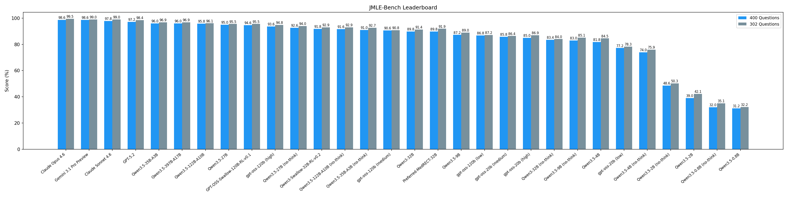

# JMLE2026-Bench (IgakuQA120)

LLM benchmark on the 120th Japanese Medical Licensing Examination (Feb 7-8, 2026).

400 questions (302 text-only + 98 with clinical images) structured as JSON with ground-truth answers.

Previous year (119th): [IgakuQA119](https://github.com/naoto-iwase/IgakuQA119) (Feb 8-9, 2025)

Interactive Viewer: https://jmle2026-bench.streamlit.app

## Leaderboard



### All (400 Questions)

<!-- leaderboard-all-start -->
| Model | Vision | Score | Accuracy |
|-----|------|-----|--------|
| **Claude Opus 4.6** | ✓ | 493/500 (98.6%) | 393/400 (98.2%) |
| **Gemini 3.1 Pro Preview** | ✓ | 493/500 (98.6%) | 393/400 (98.2%) |
| **Claude Sonnet 4.6** | ✓ | 489/500 (97.8%) | 391/400 (97.8%) |
| **GPT-5.2** | ✓ | 486/500 (97.2%) | 386/400 (96.5%) |
| **Qwen3.5-35B-A3B** | ✓ | 480/500 (96.0%) | 380/400 (95.0%) |
| **Qwen3.5-397B-A17B** | ✓ | 480/500 (96.0%) | 382/400 (95.5%) |
| **Qwen3.5-122B-A10B** | ✓ | 479/500 (95.8%) | 381/400 (95.2%) |
| **Qwen3.5-27B** | ✓ | 475/500 (95.0%) | 381/400 (95.2%) |
| **GPT-OSS-Swallow-120B-RL-v0.1** | - | 473/500 (94.6%) | 379/400 (94.8%) |
| **gpt-oss-120b (high)** | - | 468/500 (93.6%) | 374/400 (93.5%) |
| **Qwen3.5-27B (no-think)** | ✓ | 463/500 (92.6%) | 365/400 (91.2%) |
| **Qwen3-Swallow-32B-RL-v0.2** | - | 459/500 (91.8%) | 365/400 (91.2%) |
| **Qwen3.5-122B-A10B (no-think)** | ✓ | 458/500 (91.6%) | 366/400 (91.5%) |
| **Qwen3.5-35B-A3B (no-think)** | ✓ | 455/500 (91.0%) | 365/400 (91.2%) |
| **gpt-oss-120b (medium)** | - | 453/500 (90.6%) | 363/400 (90.8%) |
| **Qwen3-32B** | - | 449/500 (89.8%) | 353/400 (88.2%) |
| **Preferred-MedRECT-32B** | - | 449/500 (89.8%) | 357/400 (89.2%) |
| **Qwen3.5-9B** | ✓ | 436/500 (87.2%) | 346/400 (86.5%) |
| **gpt-oss-120b (low)** | - | 434/500 (86.8%) | 344/400 (86.0%) |
| **gpt-oss-20b (medium)** | - | 429/500 (85.8%) | 343/400 (85.8%) |
| **gpt-oss-20b (high)** | - | 425/500 (85.0%) | 337/400 (84.2%) |
| **Qwen3-32B (no-think)** | - | 417/500 (83.4%) | 327/400 (81.8%) |
| Qwen3.5-9B (no-think) | ✓ | 415/500 (83.0%) | 337/400 (84.2%) |
| **Qwen3.5-4B** | ✓ | 409/500 (81.8%) | 323/400 (80.8%) |
| gpt-oss-20b (low) | - | 386/500 (77.2%) | 306/400 (76.5%) |
| Qwen3.5-4B (no-think) | ✓ | 370/500 (74.0%) | 292/400 (73.0%) |
| Qwen3.5-2B (no-think) | ✓ | 243/500 (48.6%) | 191/400 (47.8%) |
| Qwen3.5-2B | ✓ | 195/500 (39.0%) | 147/400 (36.8%) |
| Qwen3.5-0.8B (no-think) | ✓ | 160/500 (32.0%) | 126/400 (31.5%) |
| Qwen3.5-0.8B | ✓ | 156/500 (31.2%) | 112/400 (28.0%) |
<!-- leaderboard-all-end -->

*Bold = passes both required (160/200) and general (224/300) thresholds based on the [official criteria](#scoring).*

### Text-only (302 Questions)

<!-- leaderboard-text-start -->
| Model | Score | Accuracy |
|-----|-----|--------|
| Claude Opus 4.6 | 380/382 (99.5%) | 300/302 (99.3%) |
| Claude Sonnet 4.6 | 378/382 (99.0%) | 298/302 (98.7%) |
| Gemini 3.1 Pro Preview | 378/382 (99.0%) | 298/302 (98.7%) |
| GPT-5.2 | 376/382 (98.4%) | 296/302 (98.0%) |
| Qwen3.5-35B-A3B | 370/382 (96.9%) | 290/302 (96.0%) |
| Qwen3.5-397B-A17B | 370/382 (96.9%) | 292/302 (96.7%) |
| Qwen3.5-122B-A10B | 367/382 (96.1%) | 289/302 (95.7%) |
| Qwen3.5-27B | 365/382 (95.5%) | 291/302 (96.4%) |
| GPT-OSS-Swallow-120B-RL-v0.1 | 365/382 (95.5%) | 289/302 (95.7%) |
| gpt-oss-120b (high) | 362/382 (94.8%) | 286/302 (94.7%) |
| Qwen3.5-27B (no-think) | 359/382 (94.0%) | 281/302 (93.0%) |
| Qwen3.5-122B-A10B (no-think) | 355/382 (92.9%) | 281/302 (93.0%) |
| Qwen3-Swallow-32B-RL-v0.2 | 355/382 (92.9%) | 281/302 (93.0%) |
| Qwen3.5-35B-A3B (no-think) | 354/382 (92.7%) | 280/302 (92.7%) |
| Preferred-MedRECT-32B | 351/382 (91.9%) | 277/302 (91.7%) |
| Qwen3-32B | 349/382 (91.4%) | 273/302 (90.4%) |
| gpt-oss-120b (medium) | 347/382 (90.8%) | 275/302 (91.1%) |
| Qwen3.5-9B | 340/382 (89.0%) | 270/302 (89.4%) |
| gpt-oss-120b (low) | 333/382 (87.2%) | 263/302 (87.1%) |
| gpt-oss-20b (high) | 332/382 (86.9%) | 258/302 (85.4%) |
| gpt-oss-20b (medium) | 330/382 (86.4%) | 262/302 (86.8%) |
| Qwen3.5-9B (no-think) | 325/382 (85.1%) | 261/302 (86.4%) |
| Qwen3.5-4B | 323/382 (84.5%) | 253/302 (83.8%) |
| Qwen3-32B (no-think) | 321/382 (84.0%) | 251/302 (83.1%) |
| gpt-oss-20b (low) | 299/382 (78.3%) | 235/302 (77.8%) |
| Qwen3.5-4B (no-think) | 290/382 (75.9%) | 228/302 (75.5%) |
| Qwen3.5-2B (no-think) | 192/382 (50.3%) | 148/302 (49.0%) |
| Qwen3.5-2B | 161/382 (42.1%) | 121/302 (40.1%) |
| Qwen3.5-0.8B (no-think) | 134/382 (35.1%) | 104/302 (34.4%) |
| Qwen3.5-0.8B | 123/382 (32.2%) | 89/302 (29.5%) |
<!-- leaderboard-text-end -->

## Quick Start

Requires [uv](https://docs.astral.sh/uv/).

```bash
uv run benchmark.py --model gpt-5.2 --api-key $OPENAI_API_KEY
```

See [usage.md](usage.md) for all options and reproduction commands.

## Scoring

The score follows the official exam scoring system (500 points total):

| Category | Blocks | Questions | Points | Max |
|----------|--------|-----------|--------|-----|
| Required (必修) | B, E | 50 each | Q1-25: 1pt, Q26-50: 3pt | 200 |
| General (一般+臨床) | A, C, D, F | 75 each | 1pt each | 300 |

**Passing criteria (120th exam, [official](https://www.mhlw.go.jp/general/sikaku/successlist/2026/siken01/about.html)):**
1. Required (B+E): 160/200 or higher (fixed every year)
2. General (A+C+D+F): 224/300 or higher (varies each year based on overall performance)
3. Prohibited choices (禁忌肢): 3 or fewer (fixed every year; which questions contain prohibited choices is not publicly disclosed)

## Dataset

- `jmle2026_dataset.json`: 400 questions (302 text-only, 98 with clinical images)
- `images/`: 110 clinical images referenced by `clinical_images` field
- Answers are based on the [official answer key](https://www.mhlw.go.jp/general/sikaku/successlist/2026/siken01/dl/seitou.pdf)

## License

- Code: [MIT](https://opensource.org/licenses/MIT)
- Dataset: [CC BY 4.0](https://creativecommons.org/licenses/by/4.0/)
  - Original exam data is published by the Ministry of Health, Labour and Welfare under [PDL 1.0](https://www.digital.go.jp/resources/open_data/public_data_license_v1.0) (CC BY 4.0 compatible).
- Results (`results/`): Each model's output is subject to the terms of service or license of the respective model provider. Use under the most permissive conditions allowed by each provider.
